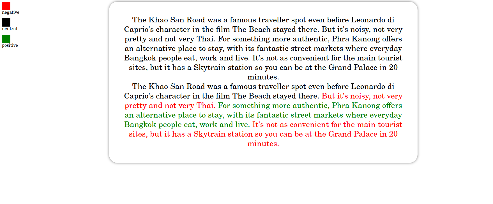

# Недо веб сервис.
## Что работает?
1) свой ключ и т.д.
2) Поиск эмоционально окрашенных фраз в тексте и оформление их цветом с помощью HTML-тегов
3) Текст из файла
## Что не работает
1) веб сервис, для ввода текста и впоследствии манипуляции с ним
# Пример
текст их файла text.txt \
вводим в консоли `python3 ./main.py` \
зайти открыть файл out.html \

