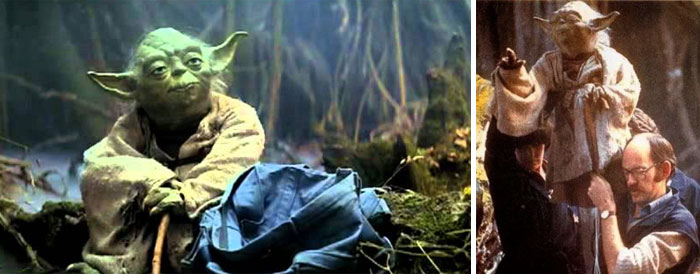
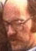

###Режем картинку на лица и портим картинку прямоугольниками.

##Прежде всего координаты
Что бы получить координаты лиц, воспользуемся api для распознования \ 
Я использовал Microsoft Azur Face API со своим ключем и сервером в East US \
скрипт image.sh занимается тем, что шлет картинку через API и получается координаты лиц\
далее передает их в питон скрипт
##Сами прямоугольники
Поскольку координаты у нас уже есть, я воспользовался библиотекой PIL и\
1 - обрезал все лица и сохранил их в разные файлы \
2 - сохранил новое изображение с прямоугольниками, внутри которых лица. \
в файле facereqtangle.py описан скрипт.
пример 
 \
\

