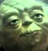

### Режем картинку на лица и портим картинку прямоугольниками.

## Прежде всего координаты
Что бы получить координаты лиц, воспользуемся api для распознования \ 
Я использовал Microsoft Azur Face API со своим ключем и сервером в East US \
скрипт image.sh занимается тем, что шлет картинку через API и получается координаты лиц\
далее передает их в питон скрипт
## Сами прямоугольники
Поскольку координаты у нас уже есть, я воспользовался библиотекой PIL и\
1 - обрезал все лица и сохранил их в разные файлы \
2 - сохранил новое изображение с прямоугольниками, внутри которых лица. \
в файле facereqtangle.py описан скрипт.
## пример
### исходная картинка
 \
### Картинка с прямоугольничками
\
### Лицо 1

{:height="50px" width="50px"}
### Лицо 2

{:height="50px" width="50px"}

